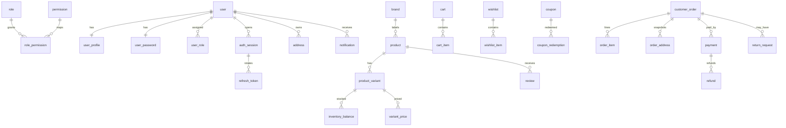
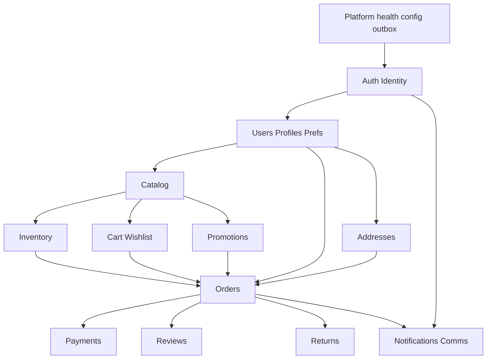

# Elevate Apparel — Unified Backend & PostgreSQL Implementation Roadmap

> **Status:** Planning complete. **Do not implement commerce modules until this document is accepted.**
>
> **Scope rule:** Every decision is grounded in the current monorepo (`frontend/`, `backend/`, `PROJECT_OVERVIEW.md`, `CLAUDE.md`). Features not present in code or docs (wallets, subscriptions, affiliate, admin/vendor UIs, Socket.IO dashboards) are **out of scope** for v1 unless listed as explicit future extensions.
>
> **Stack decision:** Continue **NestJS 11 + Prisma 6 + PostgreSQL 17 + Redis 7 + BullMQ**. Do not rewrite to Express.

---

## Document map (final deliverables)

| # | Deliverable | Section |
|---|-------------|---------|
| 1 | Project Analysis | §1 |
| 2 | Feature Inventory | §2 |
| 3 | Domain Breakdown | §3 |
| 4 | Database Architecture | §4 |
| 5 | ER Diagram | §5 |
| 6 | Table Design | §6 |
| 7 | API Specification | §7 |
| 8 | Backend Architecture | §8 |
| 9 | Folder Structure | §9 |
| 10 | Module Dependency Graph | §10 |
| 11 | Security Architecture | §11 |
| 12 | Performance Strategy | §12 |
| 13 | PostgreSQL Optimization | §13 |
| 14 | Transaction Strategy | §14 |
| 15 | Payment Integrity Strategy | §15 |
| 16 | Registration Flow Strategy | §16 |
| 17 | Caching Strategy | §17 |
| 18 | Queue Strategy | §18 |
| 19 | Deployment Strategy | §19 |
| 20 | CI/CD Strategy | §20 |
| 21 | Testing Strategy | §21 |
| 22 | Step-by-Step Implementation Roadmap | §22 |
| 23 | Module-by-Module Development Order | §23 |
| 24 | Risk Assessment | §24 |
| 25 | Future Scalability Plan | §25 |

**Mandatory build rule:** For every module: **Schema → Migration → Seed (if needed) → DTOs → Repository → Service → Controller → Swagger → Tests → Frontend repository swap**. Never ship an API without a finalized schema for that module.

---

## 1. Project Analysis

### Purpose

Elevate Apparel is a Bangladesh-oriented premium apparel ecommerce storefront (BDT/৳, COD/bKash/card UI, Dhaka-centric addresses). The monorepo contains:

| App | Role | Maturity |
|-----|------|----------|
| `frontend/` | Next.js 16 storefront | Broad UI; commerce data mostly local |
| `backend/` | NestJS 11 API (`/api/v1`) | Auth + health only |
| `docker-compose.yml` | Postgres 17 + Redis 7 | Local deps only |

### What is real today

- **HTTP:** `POST /auth/register|login|refresh|logout`, `GET /health`
- **DB:** single `"User"` table (UUID, email, passwordHash, Role, UserStatus, names, refreshTokenHash, soft delete)
- **Auth:** JWT access 15m + Argon2-hashed refresh cookie (single hash per user — concurrency-unsafe)
- **Frontend:** polished shop/PDP/cart/checkout/account; products from `features/products/data.ts`; account from `accountRepository` → localStorage

### What is not implemented

Products, inventory, carts (server), wishlists (server), coupons (server), orders, payments, reviews CRUD, returns, notifications (server), password reset, profile/phone persistence, contact/newsletter persistence, admin UI, affiliate, Google OAuth (button disabled), CI, automated tests, production Docker.

### User journeys (from frontend)

1. Browse → filter/sort/search → PDP → cart/wishlist
2. Guest or member checkout → coupon (members) → COD/bKash/card selector → confirmation / account order
3. Account: profile, password (simulated), addresses, orders, track, coupons, notifications, reviews list, returns/exchanges, settings
4. Auth: register → login → refresh interceptor → logout; forgot/reset password UI only
5. Contact / newsletter / WhatsApp order (no persistence)

### Roles (typed, backend enum)

`SUPER_ADMIN` | `ADMIN` | `CUSTOMER` — storefront uses CUSTOMER only; no role-gated frontend routes yet. The platform is single-merchant: the `VENDOR` role and vendor domain were removed. SUPER_ADMIN has unrestricted access and exclusively manages admin accounts; ADMIN manages customers and business resources but can never modify another admin or Super Admin.

### Evidence sources

- [PROJECT_OVERVIEW.md](../PROJECT_OVERVIEW.md), [CLAUDE.md](../CLAUDE.md)
- [backend/prisma/schema.prisma](../backend/prisma/schema.prisma)
- [frontend/features/products/types.ts](../frontend/features/products/types.ts), [data.ts](../frontend/features/products/data.ts)
- [frontend/features/account/storage.ts](../frontend/features/account/storage.ts)
- [frontend/app/checkout/checkout-client.tsx](../frontend/app/checkout/checkout-client.tsx)

---

## 2. Feature Inventory

### Implemented (API-backed)

| Feature | Notes |
|---------|--------|
| Register / Login / Refresh / Logout | Works; harden sessions |
| Health liveness | No DB/Redis readiness |

### Implemented (UI + local/mock)

| Feature | Data source |
|---------|-------------|
| Catalog (12 products), filters, sort, pagination | `data.ts` |
| PDP variants, gallery, static reviews, related | local |
| Cart / wishlist / recently viewed | Redux + localStorage |
| Checkout, coupons, shipping ৳120, FREESHIP | local rules |
| Account addresses, orders, notifications, coupons, returns, reviews list | localStorage |
| Static pages (about, FAQs, policies, store, size guide) | code |

### Placeholders / simulated

Forgot/reset/change password, Google login, contact/newsletter, bKash/card gateways, guest track-order (account-local only), settings preferences, profile phone.

### Explicit non-goals (v1)

Affiliate marketing, vendor marketplace UI, admin dashboard UI, wallets, subscriptions, Socket.IO live dashboards, Elasticsearch (until Postgres FTS proves insufficient).

---

## 3. Domain Breakdown

For each domain: purpose, business rules, tables, APIs, jobs, cache, permissions.

### 3.1 Platform (cross-cutting)

| Aspect | Design |
|--------|--------|
| Purpose | Config, logging, errors, response envelope, throttling, health, outbox, idempotency, audit |
| Tables | `idempotency_key`, `outbox_event`, `audit_log` |
| Jobs | Outbox relay → BullMQ |
| Cache | None for authority |

### 3.2 Identity & Access

| Aspect | Design |
|--------|--------|
| Purpose | Users, credentials, sessions, RBAC, OAuth-ready links, verification, login/security history |
| Rules | Email unique canonical lowercase; Argon2id passwords; refresh rotate + reuse detection; suspended/deleted cannot auth; PENDING policy: **cannot login until ACTIVE** (align registration to ACTIVE or verify-email first) |
| Tables | `user`, `user_profile`, `user_password`, `role`, `permission`, `user_role`, `role_permission`, `auth_session`, `refresh_token`, `device`, `oauth_account`, `verification_token`, `login_event`, `security_event`, `user_preference`, `consent_event` |
| APIs | Auth + `/users/me` + password change/reset |
| Permissions | `customer.self`, admin later |
| Jobs | Expire tokens, purge login events |
| Cache | Permission map short TTL optional |

### 3.3 Addresses

| Aspect | Design |
|--------|--------|
| Purpose | Saved shipping/billing; checkout snapshots separate |
| Rules | One default per `(user, type)`; Bangladesh-first; checkout does not auto-save address book |
| Tables | `address` |
| APIs | CRUD `/addresses` |
| Permissions | Own resources only |

### 3.4 Merchant ownership (single-merchant)

| Aspect | Design |
|--------|--------|
| Purpose | The platform sells only Elevate Apparel products — no marketplace |
| Rules | No vendor tables or `VENDOR` role; products are platform-owned |
| Tables | None (removed `vendor`, `vendor_member`) |
| APIs | None |

### 3.5 Catalog

| Aspect | Design |
|--------|--------|
| Purpose | Brands, categories, collections, products, options, variants, media, prices |
| Rules | Slug unique among active; SKU unique; prices immutable rows with validity; filters match frontend |
| Tables | `brand`, `category`, `collection`, `product`, `product_category`, `product_collection`, `product_option`, `product_option_value`, `product_variant`, `variant_option_value`, `product_media`, `variant_price` |
| APIs | Public list/detail/related/new/sale/search/categories/brands |
| Jobs | Cache invalidation on publish |
| Cache | Product-by-slug, category tree, homepage lists |
| Search | `tsvector` + GIN; pg_trgm later if needed |

### 3.6 Inventory

| Aspect | Design |
|--------|--------|
| Purpose | On-hand/reserved stock, reservations, immutable movements |
| Rules | Never sell past available; lock balances in ID order; movement is source of audit |
| Tables | `inventory_location`, `inventory_balance`, `inventory_reservation`, `inventory_reservation_item`, `inventory_movement` |
| APIs | Internal to checkout; admin adjust later |
| Jobs | Expire reservations |

### 3.7 Cart & Wishlist

| Aspect | Design |
|--------|--------|
| Purpose | Server cart (user/guest), wishlist, optional recently viewed |
| Rules | Unique line per variant; prices not trusted from cart; merge guest→user on login |
| Tables | `cart`, `cart_item`, `wishlist`, `wishlist_item`, `recently_viewed_product` |
| APIs | `/cart`, `/wishlist` |
| Cache | Short-lived cart optional; invalidate on mutate |

### 3.8 Promotions

| Aspect | Design |
|--------|--------|
| Purpose | Coupons; fix FREESHIP double-benefit bug (shipping OR discount, not both) |
| Rules | Case-insensitive unique code; auth required for account coupons; server recalculates |
| Tables | `promotion`, `coupon`, `promotion_product`, `promotion_category`, `coupon_redemption` |
| APIs | `POST /coupons/validate`, `GET /coupons/mine` |

### 3.9 Orders & Fulfillment

| Aspect | Design |
|--------|--------|
| Purpose | Guest/member orders, snapshots, timeline, tracking, shipments |
| Rules | Client totals ignored; immutable line/address snapshots; statuses: pending→confirmed→processing→shipped→delivered / cancelled / returned |
| Tables | `customer_order`, `order_address`, `order_item`, `order_status_history`, `shipment`, `shipment_item` |
| APIs | Create, list, detail, public track |
| Jobs | Status emails via outbox |

### 3.10 Payments

| Aspect | Design |
|--------|--------|
| Purpose | COD first; bKash/card later with webhooks |
| Rules | Idempotent attempts; never store PAN/CVV; double-entry ledger for reconciliation |
| Tables | `payment`, `payment_attempt`, `webhook_event`, `refund`, `refund_item`, `ledger_account`, `ledger_transaction`, `ledger_entry` |
| APIs | Init (later), webhooks, admin capture COD |

### 3.11 Reviews

| Aspect | Design |
|--------|--------|
| Purpose | Moderated reviews; verified purchase |
| Rules | One active review per user/product; update product rating aggregates in same txn |
| Tables | `review`, `review_media` |
| APIs | List public; create/own list authenticated |

### 3.12 Returns & Exchanges

| Aspect | Design |
|--------|--------|
| Purpose | Return/exchange requests with line items |
| Rules | Enforce 7-day / sale-exchange-only in service (versioned policy); quantities ≤ delivered |
| Tables | `return_request`, `return_item`, `return_status_history` |
| APIs | Create/list |

### 3.13 Notifications & Comms

| Aspect | Design |
|--------|--------|
| Purpose | In-app inbox, email delivery, contact, newsletter |
| Tables | `notification`, `notification_delivery`, `newsletter_subscription`, `contact_message` |
| APIs | Notifications CRUD-ish; contact/newsletter POST |
| Jobs | Email send workers |

### 3.14 Uploads

| Aspect | Design |
|--------|--------|
| Purpose | Product/review media metadata → object storage |
| Tables | `product_media` / `review_media` (storage keys) |
| APIs | Admin upload (v2 storefront-facing none) |

### Domains NOT in v1

Organizations (multi-tenant SaaS), Reports/Analytics OLTP dashboards (use warehouse later), Socket.IO realtime, CMS content tables (static pages stay in code until admin CMS is required).

---

## 4. Database Architecture

### Principles

- PostgreSQL 17 primary + optional read replicas
- Singular `snake_case` physical names via Prisma `@map` / `@@map`
- UUID public IDs (app UUIDv7 for new aggregates; keep existing user UUIDs)
- `bigint` identity for high-volume append-only logs
- Money: `bigint` minor units (BDT poisha: taka × 100) + `currency_code char(3)`
- Timestamps: `timestamptz(3)` UTC (migrate current `timestamp(3)`)
- Soft delete only master/customer-editable data; never soft-delete financial/order history
- Optimistic `version` on hot mutable rows (`inventory_balance`, `cart`, `payment`)
- Redis never authoritative for stock, coupons, payments, or tokens

### Topology

```text
NestJS API (stateless) ──ACID──► PostgreSQL primary
        │                              │
        ├── Redis (cache)              ├── read replicas (catalog/history)
        └── BullMQ workers ◄── outbox_event
```

### Migration philosophy

Expand → dual-write/backfill → switch read → contract. One commerce domain per migration batch. Named raw SQL for partial/exclusion/deferrable constraints Prisma cannot express.

---

## 5. ER Diagram



Full column-level design: see prior plan [`postgresql_database_architecture`](../.cursor/plans/postgresql_database_architecture_0b7e2780.plan.md) and §6 summary below.

---

## 6. Table Design (summary)

### Conventions per table

- Mutable: `created_at`, `updated_at`, `version` where contended
- Soft-delete: `deleted_at` on user, address, product, brand, category, collection, coupon, review, wishlist
- Immutable: `created_at` only — order_*, payment_attempt, ledger_*, inventory_movement, *_history, audit_log, login_event, security_event, outbox_event

### Core tables (grouped)

| Group | Tables | Key constraints / indexes |
|-------|--------|---------------------------|
| Identity | `user`, `user_profile`, `user_password`, `role`, `permission`, `user_role`, `role_permission` | Unique email; partial unique roles; RBAC FKs RESTRICT |
| Sessions | `auth_session`, `refresh_token`, `device`, `verification_token`, `oauth_account` | Unique `token_hash`; family reuse revoke; partial active indexes |
| Security | `login_event`, `security_event`, `audit_log` | BRIN/partition by time later |
| Profile | `address`, `user_preference`, `consent_event` | One default address per type |
| Catalog | brand/category/collection/product/options/variants/media/prices | Unique slug/SKU; GiST exclusion on price ranges; GIN search |
| Inventory | location/balance/reservation/items/movement | `reserved <= on_hand`; movement idempotency |
| Cart/Wish | cart/cart_item/wishlist/wishlist_item/recently_viewed | XOR user/guest; unique lines |
| Promo | promotion/coupon/eligibility/redemption | Unique uppercase code; redemption unique per order |
| Order | customer_order/address/item/status_history/shipment* | Unique order_number; total arithmetic CHECK |
| Pay | payment/attempt/webhook/refund*/ledger* | Unique provider event/txn; balanced ledger trigger |
| Social | review/review_media | Unique user+product active |
| Returns | return_request/item/status_history | Qty ≤ purchased |
| Comms | notification*/newsletter/contact | Partial unread index |
| Ops | idempotency_key, outbox_event | Unique scope+key; work queue index |

### Cascade policy (short)

- Disposable user state (sessions, carts, wishlist): CASCADE
- Commerce history (orders, payments, ledger): RESTRICT / SET NULL + snapshots
- Published catalog: soft-delete/archive; RESTRICT hard deletes with order refs

---

## 7. API Specification

Base: `https://api…/api/v1`  
Envelope (migrate to CLAUDE.md target):

```json
{ "success": true, "message": "…", "data": {}, "meta": {} }
```

Auth: Bearer access JWT unless `@Public()`. Refresh: HTTP-only cookie `refresh_token`.

### 7.1 Existing (harden)

| Method | Path | Auth | Notes |
|--------|------|------|-------|
| GET | `/health` | Public | Add readiness: DB + Redis |
| POST | `/auth/register` | Public | Create user+profile+password+role; 409 on email |
| POST | `/auth/login` | Public | Session + rotating refresh; reject non-ACTIVE |
| POST | `/auth/refresh` | Cookie | Row-lock rotate; reuse → revoke family; JWT errors → 401 |
| POST | `/auth/logout` | Bearer | Revoke session |

### 7.2 Identity (next)

| Method | Path | Auth | Body / notes |
|--------|------|------|----------------|
| POST | `/auth/forgot-password` | Public | `{ email }` → always 202 |
| POST | `/auth/reset-password` | Public | `{ token, password }` |
| GET | `/users/me` | Bearer | Profile + prefs |
| PATCH | `/users/me` | Bearer | firstName, lastName, phone |
| POST | `/users/me/password` | Bearer | current + new; revoke other sessions |

### 7.3 Catalog (public)

| Method | Path | Query / notes |
|--------|------|----------------|
| GET | `/products` | filters*, sort, page/pageSize or cursor |
| GET | `/products/:slug` | detail + variants + media + rating |
| GET | `/products/:slug/related` | limit |
| GET | `/products/new-arrivals` | |
| GET | `/products/on-sale` | |
| GET | `/search` | `q`, limit |
| GET | `/categories` | tree |
| GET | `/brands` | list |

\*collections, categories, brands, sizes, colors, min/max price, availability, discount, minRating, query — mirrors frontend `ProductFilters`.

### 7.4 Cart / wishlist

| Method | Path | Auth |
|--------|------|------|
| GET/PUT | `/cart` | Bearer or guest token header |
| POST/PATCH/DELETE | `/cart/items` | same |
| POST | `/cart/merge` | Bearer (post-login) |
| GET | `/wishlist` | Bearer |
| PUT/DELETE | `/wishlist/:productId` | Bearer |

### 7.5 Coupons / orders

| Method | Path | Auth | Transaction |
|--------|------|------|-------------|
| POST | `/coupons/validate` | Optional/Bearer | Read + lock promo |
| GET | `/coupons/mine` | Bearer | |
| POST | `/orders` | Public+Bearer | Full checkout txn + Idempotency-Key |
| GET | `/orders` | Bearer | Cursor page |
| GET | `/orders/:id` | Bearer ownership | |
| GET | `/orders/track` | Public | number + email/phone |

### 7.6 Account

| Method | Path | Auth |
|--------|------|------|
| CRUD | `/addresses` | Bearer |
| GET/PATCH | `/notifications` | Bearer |
| POST | `/notifications/read-all` | Bearer |
| GET/POST | `/reviews` | Public list / Bearer create |
| GET/POST | `/returns` | Bearer |

### 7.7 Payments (phase after COD)

| Method | Path | Auth |
|--------|------|------|
| POST | `/payments/bkash/init` | Order owner |
| POST | `/payments/webhooks/bkash` | Signature |
| POST | `/payments/webhooks/card` | Signature |

### 7.8 Content ingest

| Method | Path | Auth |
|--------|------|------|
| POST | `/contact` | Public + strict throttle |
| POST | `/newsletter` | Public + strict throttle |

### Error contract

`400` validation · `401` auth · `403` RBAC · `404` · `409` conflict (email, stock, coupon, idempotency mismatch) · `429` · `500` unexpected (never leak stacks).

### Frontend integration

Swap exports only:

- `productCatalog` → `httpProductCatalog`
- `accountRepository` → `httpAccountRepository`

Keep pages/hooks; do not bypass repositories.

---

## 8. Backend Architecture

### Style

Clean layered NestJS feature modules:

```text
Controller (HTTP/DTO/Swagger)
  → Service (business rules, transactions, events)
    → Repository (Prisma selects, locks, pagination)
      → PostgreSQL
```

No business logic in controllers. No Prisma in controllers. Guards/filters/interceptors global.

### Keep / extend existing

- Global `ValidationPipe` (whitelist + forbidNonWhitelisted)
- `JwtAuthGuard` + `@Public()` + `RolesGuard` + `@Roles()`
- Helmet, compression, CORS credentials, cookie parser
- Throttler (tighten auth/contact)
- Pino redaction
- Swagger `/docs` (complete `@ApiProperty` / operations)

### Response interceptor

Migrate from `{ data }` to `{ success, message, data, meta }` with coordinated frontend `unwrapData` update in the same release.

---

## 9. Folder Structure

```text
backend/
├── prisma/
│   ├── schema.prisma
│   ├── migrations/
│   └── seed.ts
├── src/
│   ├── main.ts
│   ├── app.module.ts
│   ├── config/                 # env validation, config modules
│   ├── prisma/                 # PrismaModule / PrismaService
│   ├── common/
│   │   ├── decorators/         # Public, Roles, CurrentUser, Idempotency
│   │   ├── guards/
│   │   ├── filters/
│   │   ├── interceptors/
│   │   ├── dto/                # pagination meta
│   │   └── utils/              # money, cursor, hashing
│   ├── modules/
│   │   ├── health/
│   │   ├── auth/
│   │   ├── users/
│   │   ├── addresses/
│   │   ├── catalog/            # products, categories, brands
│   │   ├── inventory/
│   │   ├── cart/
│   │   ├── wishlist/
│   │   ├── promotions/
│   │   ├── orders/
│   │   ├── payments/
│   │   ├── reviews/
│   │   ├── returns/
│   │   ├── notifications/
│   │   ├── contact/
│   │   └── uploads/
│   ├── jobs/                   # BullMQ processors
│   └── database/               # seed helpers
└── test/                       # e2e
```

Each feature module: `*.module.ts`, `*.controller.ts`, `*.service.ts`, `*.repository.ts`, `dto/`, specs.

**Do not** create empty stub modules ahead of implementation.

---

## 10. Module Dependency Graph



**Build order follows edges left-to-right / top-to-bottom.** Orders require Catalog + Inventory + Promo (+ optional Cart). Payments require Orders. Reviews/Returns require delivered Orders.

---

## 11. Security Architecture

| Control | Implementation |
|---------|----------------|
| Passwords | Argon2id; isolated `user_password` table |
| Tokens | Access JWT 15m; refresh hashed, rotated, family reuse revoke |
| JWT validate | Load user status/deleted/role on each request (or short-lived version claim) |
| RBAC | `role`/`permission` tables + `@Roles` / permission decorator |
| Validation | DTO class-validator; never trust client money/stock |
| Injection | Prisma parameterized only; raw SQL bind params |
| Rate limit | Global + stricter auth/contact/newsletter; Redis store for multi-instance |
| Headers | Helmet |
| CORS | `FRONTEND_ORIGIN` allowlist + credentials |
| Cookies | HttpOnly; Secure in prod; SameSite=Lax (or None+Secure if cross-site) |
| CSRF | SameSite + CORS for cookie refresh; state-changing APIs use Bearer |
| PII | Soft-delete anonymization; redact logs (already Pino paths) |
| Payments | No PAN/CVV; encrypt provider blobs; webhook signatures |
| Soft-delete email | Partial unique on email WHERE deleted_at IS NULL **or** anonymize email on delete |
| Account routes | Add Next.js middleware for `/account/**` (today client-only) |

Security ships with each module — never deferred.

---

## 12. Performance Strategy

- Cursor pagination `(created_at, id)` for large lists; offset OK for small admin pages
- Prisma `select` / batch includes; ban N+1
- Partial indexes for active products, unread notifications, active carts
- Covering indexes only after `EXPLAIN` proof
- Server-side catalog filter/sort (stop shipping full catalog to browser)
- Cache product detail & category tree; never cache stock/payment
- Short transactions; no HTTP inside DB locks
- `pg_stat_statements` + p95 latency alerts

---

## 13. PostgreSQL Optimization Strategy

- Autovacuum more aggressive on `inventory_balance`, `cart_item`, `notification`, `idempotency_key`
- Partition monthly: `audit_log`, `login_event`, `outbox_event`, `inventory_movement`, `webhook_event` — **only after volume**
- GIN on product `search_vector`; GiST exclusion for price windows
- BRIN on append-only timestamps
- Avoid partitioning `customer_order` / `user` early
- Materialized views for admin analytics only (concurrent refresh)
- Connection pooling via PgBouncer; sized below `max_connections`

---

## 14. Transaction Strategy

| Workflow | Isolation / locking |
|----------|---------------------|
| Register | READ COMMITTED; unique email catch → 409 |
| Refresh rotate | `SELECT … FOR UPDATE` token/session; deterministic order |
| Checkout | Idempotency claim → lock inventory by variant ID order → lock coupon → insert order/payment/reservation/outbox |
| Webhook | Unique provider event → lock payment → append attempt/ledger → update status |
| Refund | Lock payment → sum refunds → append refund/ledger |
| Inventory adjust | Lock balance → movement + update |

Deadlock prevention: always lock resources in global ID order. Retry transient serialization/deadlock with jitter (bounded).

---

## 15. Payment Integrity Strategy

1. **COD (v1):** create `payment` pending/authorized-on-delivery; capture on delivery event; ledger receivable → cash/clearing.
2. **bKash/card (v2):** init attempt with Idempotency-Key; provider redirect/callback; webhook dedupe; capture only when amount/currency/order match.
3. Immutable `payment_attempt` + `webhook_event`; unique provider txn/event IDs.
4. Refunds cannot exceed captured; allocations sum to refund.
5. Double-entry `ledger_*` for reconciliation (not customer wallets).
6. UI: until providers live, either hide bKash/card or label “coming soon” — do not fake paid state.

---

## 16. Registration Flow Strategy

```text
Client POST /auth/register
  → validate DTO (names min length after trim, password policy)
  → canonicalize email
  → BEGIN
       insert user (status ACTIVE for current product behavior, or PENDING + email verify)
       insert user_profile, user_password, user_role(CUSTOMER), user_preference
       insert security_event + outbox (welcome email)
  → COMMIT
  → 201 user (no session) — frontend then calls login (current UX)
```

Future: email verification before ACTIVE; OAuth link via `oauth_account`.  
Concurrent register: rely on unique index, map P2002 → 409.

---

## 17. Caching Strategy

| Data | Store | TTL / invalidate |
|------|-------|------------------|
| Product by slug | Redis | Version key / outbox invalidate |
| Category tree | Redis | On category write |
| Homepage merchandising | Redis | On publish |
| Permission set | Redis optional | On role change |
| Stock, coupons, carts, payments, tokens | **Never** | — |

CDN for media URLs only.

---

## 18. Queue Strategy

BullMQ already configured; use **after** outbox insert:

| Queue | Jobs |
|-------|------|
| `email` | Welcome, reset password, order confirmation, shipping |
| `notification` | Fan-out in-app |
| `inventory` | Reservation expiry |
| `payments` | Webhook retry / reconcile |

Workers are horizontally scalable. No Socket.IO in v1 (not required by storefront).

---

## 19. Deployment Strategy

- Apps: multi-stage Docker, **Node 20** (match `.nvmrc`), non-root user, healthchecks
- Compose: Postgres + Redis (+ optional API) with healthchecks, no public Redis without auth in non-local
- Migrations: `prisma migrate deploy` in release job **before** new pods
- Secrets: platform env / secret manager — never commit `.env`
- Managed Postgres (PITR, WAL archive) + managed Redis TLS
- Object storage (S3/R2) for media
- Stateless API replicas behind LB; sticky sessions not required

---

## 20. CI/CD Strategy

GitHub Actions (currently missing):

1. `lint` frontend + backend  
2. `prisma validate` + migrate against ephemeral Postgres  
3. unit tests  
4. e2e auth + critical commerce  
5. `build` both workspaces  

Deploy: build images → migrate → rolling update → smoke `/health` readiness.

---

## 21. Testing Strategy

| Layer | Coverage |
|-------|----------|
| Unit | Services: coupon math, order totals, status transitions, FREESHIP semantics |
| Integration | Repositories + Postgres: register race, refresh reuse, checkout stock race, webhook dedupe |
| E2E | Auth flow, catalog read, COD place order, track order |
| Contract | OpenAPI snapshot / frontend type alignment |

Every module checklist (§22) requires tests before “done.”

---

## 22. Step-by-Step Implementation Roadmap

### Milestone 0 — Foundation hardening (no new commerce tables yet)

1. Response envelope decision + interceptor + frontend unwrap  
2. Refresh JWT errors → 401; transactional multi-session tokens (schema § Identity)  
3. JwtStrategy loads user status  
4. Health readiness (DB + Redis)  
5. Register unique → 409; name MinLength  
6. Soft-delete email policy  
7. Docker/Node 20 alignment; CI lint/build  
8. Swagger completeness for auth  

**Exit:** Auth safe for multi-device; CI green.

### Milestone 1 — Identity completion

Schema: profile, password table split, verification_token, prefs.  
APIs: forgot/reset, `/users/me`, change password.  
Frontend: wire password pages + profile phone.

### Milestone 2 — Catalog + inventory (first commerce vertical)

Schema: catalog, prices, inventory (platform-owned products; no vendor tables).  
Seed from `data.ts` (prices × 100 → poisha).  
APIs: public product endpoints.  
Frontend: `httpProductCatalog`; Server Components fetch API/cache.

### Milestone 3 — Addresses + profile polish

Address CRUD; default partial unique.

### Milestone 4 — Promotions

Coupon tables; validate API; fix FREESHIP semantics; `GET /coupons/mine`.

### Milestone 5 — COD checkout & orders

Idempotency + inventory reservation + order snapshots + track API.  
Frontend: checkout → `POST /orders`; confirmation/track from API.

### Milestone 6 — Cart / wishlist sync

Server cart/wishlist; merge on login.

### Milestone 7 — Reviews, returns, notifications, contact, newsletter

### Milestone 8 — Online payments (bKash/card) + refunds + ledger

### Milestone 9 — Email workers, cache warming, search tuning

### Milestone 10 — Admin APIs (optional UI later), partitioning ops, load test, prod cutover

---

## 23. Module-by-Module Development Order

| Order | Module | Schema first | Depends on |
|------:|--------|--------------|------------|
| 0 | Platform (envelope, health, outbox, idempotency) | ops tables | — |
| 1 | Auth / Identity | identity tables | 0 |
| 2 | Users / Prefs | profile, prefs | 1 |
| 3 | Catalog | catalog + media + price | 2 |
| 4 | Inventory | inventory* | 3 |
| 5 | Addresses | address | 2 |
| 6 | Promotions | promotion* | 3 |
| 7 | Cart / Wishlist | cart*, wishlist* | 3, 4 |
| 8 | Orders | order* | 4–7 |
| 9 | Payments (COD) | payment + ledger seed | 8 |
| 10 | Reviews | review* | 8 |
| 11 | Returns | return* | 8, 9 |
| 12 | Notifications / Contact / Newsletter | comms* | 1, 8 |
| 13 | Payments (bKash/card) | webhook/refund | 9 |
| 15 | Uploads (admin) | media keys | 4 |
| 16 | Admin catalog/order APIs | permissions | 4, 9 |

### Module completion checklist

A module is **done** only when:

- [ ] Schema + relationships + constraints + indexes  
- [ ] Migration (+ seed if required)  
- [ ] DTOs / validation  
- [ ] Repository + Service + Controller  
- [ ] AuthN / AuthZ  
- [ ] Swagger  
- [ ] Unit + integration tests  
- [ ] Logging / errors  
- [ ] Performance & security review  
- [ ] Frontend repository wired **or** explicitly deferred with ticket  

---

## 24. Risk Assessment

| Risk | Mitigation |
|------|------------|
| Express rewrite temptation | Reject; NestJS already foundation |
| Envelope mismatch `{data}` vs CLAUDE | Single coordinated migration |
| Client-trusted prices/coupons | Server recalculation always |
| FREESHIP double discount | Explicit promotion reward types |
| Refresh race / single hash | Session table + FOR UPDATE |
| Soft-delete blocks email reuse | Partial unique or anonymize |
| PENDING login allowed | Policy: ACTIVE only |
| Guest track insecure | Require number + email/phone |
| Over-partitioning early | Defer until metrics |
| Empty stub modules | Create only when implementing |
| Docker/Node mismatch | Pin Node 20; fix workspace Docker context |
| No CI/tests | Milestone 0 |
| Payment UI without gateway | COD-only until M14 |
| Admin scope creep | Users module ships admin management APIs only; defer UIs |
| Prisma vs advanced PG constraints | Raw SQL migrations reviewed |

---

## 25. Future Scalability Plan

- Horizontal API + worker replicas; shared Redis; primary write / replica read  
- Outbox → event consumers for search index, warehouse, notifications  
- Extract payments/catalog to services only when team/ops demand — keep UUID boundaries ready  
- Meilisearch/OpenSearch if FTS insufficient  
- If a marketplace is ever introduced, add vendor domain + payouts/wallets as **new** aggregates (a new Role enum value and vendor tables), not overloaded ledger accounts  
- CDC to analytics warehouse; no heavy reporting on OLTP  

---

## Acceptance gate (before coding commerce)

1. Stakeholders accept this unified roadmap.  
2. Milestone 0 identity hardening plan approved (sessions + envelope + CI).  
3. Money unit (poisha) and FREESHIP semantics accepted.  
4. PENDING vs ACTIVE registration policy accepted.  

**After acceptance:** implement Milestone 0, then Milestone 2 (catalog) as the first customer-visible commerce delivery.

---

## Related documents

- [PROJECT_OVERVIEW.md](../PROJECT_OVERVIEW.md) — current runtime reality  
- [CLAUDE.md](../CLAUDE.md) — engineering standards & brand theme  
- Cursor plans: Backend Engineering Review; PostgreSQL Database Architecture (detailed column-level schema)

---

*Last updated: 2026-07-18. Update this file whenever module order, schema boundaries, or API contracts change.*
